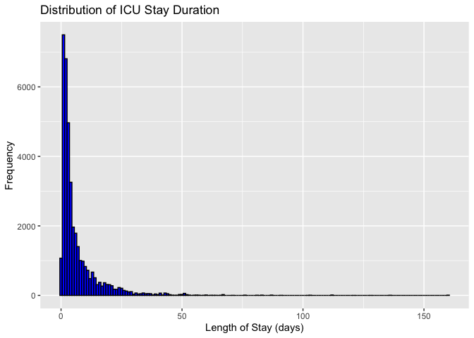
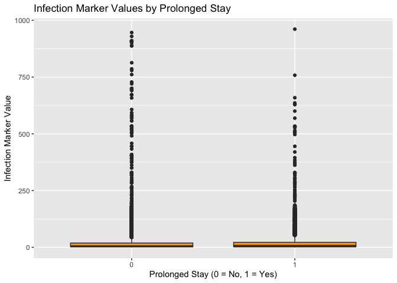
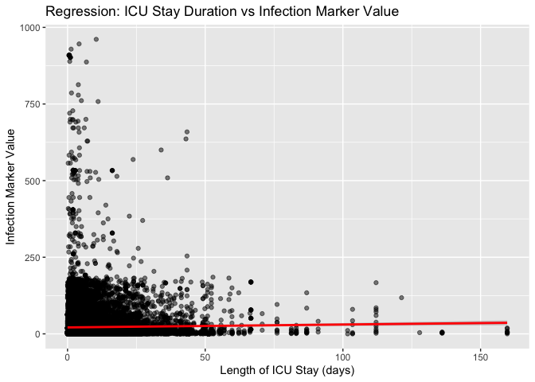
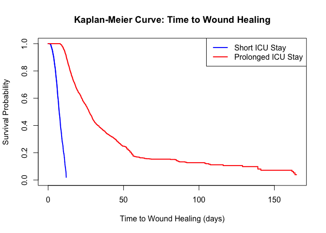
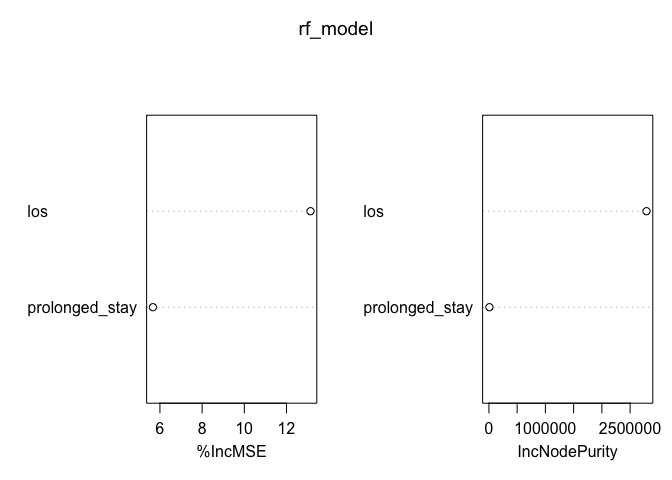

Mimic Thesis
================
Amy.Wu
2024-11-27

``` r
## Set CRAN mirror
options(repos = c(CRAN = "https://cloud.r-project.org"))

## Install required libraries if not already installed
install.packages("dplyr")
```

    ## 
    ## The downloaded binary packages are in
    ##  /var/folders/b1/gdkpvwxj4dgb11wnpw8sz8pw0000gn/T//RtmpOQHZkt/downloaded_packages

``` r
install.packages("readr")
```

    ## 
    ## The downloaded binary packages are in
    ##  /var/folders/b1/gdkpvwxj4dgb11wnpw8sz8pw0000gn/T//RtmpOQHZkt/downloaded_packages

``` r
install.packages("ggplot2")
```

    ## 
    ## The downloaded binary packages are in
    ##  /var/folders/b1/gdkpvwxj4dgb11wnpw8sz8pw0000gn/T//RtmpOQHZkt/downloaded_packages

``` r
install.packages("survival")
```

    ## 
    ## The downloaded binary packages are in
    ##  /var/folders/b1/gdkpvwxj4dgb11wnpw8sz8pw0000gn/T//RtmpOQHZkt/downloaded_packages

``` r
install.packages("randomForest")
```

    ## 
    ## The downloaded binary packages are in
    ##  /var/folders/b1/gdkpvwxj4dgb11wnpw8sz8pw0000gn/T//RtmpOQHZkt/downloaded_packages

``` r
install.packages("readr")
```

    ## 
    ## The downloaded binary packages are in
    ##  /var/folders/b1/gdkpvwxj4dgb11wnpw8sz8pw0000gn/T//RtmpOQHZkt/downloaded_packages

``` r
install.packages("stringr")
```

    ## 
    ## The downloaded binary packages are in
    ##  /var/folders/b1/gdkpvwxj4dgb11wnpw8sz8pw0000gn/T//RtmpOQHZkt/downloaded_packages

``` r
## Load libraries
library(dplyr)
```

    ## 
    ## Attaching package: 'dplyr'

    ## The following objects are masked from 'package:stats':
    ## 
    ##     filter, lag

    ## The following objects are masked from 'package:base':
    ## 
    ##     intersect, setdiff, setequal, union

``` r
library(readr)
library(ggplot2)
library(survival)
library(randomForest)
```

    ## randomForest 4.7-1.2

    ## Type rfNews() to see new features/changes/bug fixes.

    ## 
    ## Attaching package: 'randomForest'

    ## The following object is masked from 'package:ggplot2':
    ## 
    ##     margin

    ## The following object is masked from 'package:dplyr':
    ## 
    ##     combine

``` r
library(readr)
library(stringr)
```

# Aim One: investigate the relationship between ICU stay duration and wound healing outcomes in diabetic patients, identifying key predictors of impaired healing;

# Section 1: Load Data from Local CSV Files

``` r
# Load relevant tables into R
patients <- read.csv("/Users/wuxiaoyu/Desktop/9419 Master's Essay/mimic-iv-3.1/hosp/patients.csv")
icustays <- read.csv("/Users/wuxiaoyu/Desktop/9419 Master's Essay/mimic-iv-3.1/icu/icustays.csv")
diagnoses_icd <- read.csv("/Users/wuxiaoyu/Desktop/9419 Master's Essay/mimic-iv-3.1/hosp/diagnoses_icd.csv")
labevents <- read.csv("/Users/wuxiaoyu/Desktop/9419 Master's Essay/mimic-iv-3.1/hosp/labevents.csv")
procedureevents <- read.csv("/Users/wuxiaoyu/Desktop/9419 Master's Essay/mimic-iv-3.1/icu/procedureevents.csv")
microbiologyevents <- read.csv("/Users/wuxiaoyu/Desktop/9419 Master's Essay/mimic-iv-3.1/hosp/microbiologyevents.csv")
```

# Section 2: Define the Cohort

``` r
# Identify Diabetic Patients

## Filter for diabetes-related ICD codes (ICD-9: 250.xx, ICD-10: E08-E13)
diabetic_patients <- diagnoses_icd %>%
  filter(
    str_starts(icd_code, "250") | # ICD-9
    str_starts(icd_code, "E08") | # ICD-10
    str_starts(icd_code, "E09") |
    str_starts(icd_code, "E10") |
    str_starts(icd_code, "E11") |
    str_starts(icd_code, "E13")
  ) %>%
  select(subject_id) %>%
  distinct()

## View the first few diabetic patients
head(diabetic_patients)
```

    ##   subject_id
    ## 1   10000635
    ## 2   10000980
    ## 3   10001176
    ## 4   10001843
    ## 5   10001877
    ## 6   10002013

``` r
# Extract ICU Stays

## Filter ICU stays for diabetic patients
diabetic_icu_stays <- icustays %>%
  inner_join(diabetic_patients, by = "subject_id") %>%
  select(subject_id, stay_id, los) # Keep only relevant columns

## View the first few ICU stays
head(diabetic_icu_stays)
```

    ##   subject_id  stay_id       los
    ## 1   10000980 39765666 0.4975347
    ## 2   10001843 39698942 0.8252662
    ## 3   10002013 39060235 1.3143519
    ## 4   10002443 35044219 2.7507292
    ## 5   10002495 36753294 5.0875116
    ## 6   10005593 32896438 0.2928472

# Section 3: Define Wound Healing Outcomes

``` r
#Look for Wound Healing Indicators Using labevents, procedureevents, or microbiologyevents:
## Load the d_labitems table

# labevents
d_labitems <- read.csv("/Users/wuxiaoyu/Desktop/9419 Master's Essay/mimic-iv-3.1/hosp/d_labitems.csv")

## Extract unique lab test descriptions
lab_test_list <- d_labitems %>%
  select(itemid, label) %>%
  distinct()

## View the first few rows
head(lab_test_list)
```

    ##   itemid                               label
    ## 1  50801          Alveolar-arterial Gradient
    ## 2  50802                         Base Excess
    ## 3  50803 Calculated Bicarbonate, Whole Blood
    ## 4  50804                Calculated Total CO2
    ## 5  50805                   Carboxyhemoglobin
    ## 6  50806               Chloride, Whole Blood

``` r
## Save the list to a CSV file for easier inspection
write.csv(lab_test_list, "lab_test_list.csv", row.names = FALSE)

## Filter lab test descriptions for infection-related terms
infection_markers <- lab_test_list %>%
  filter(str_detect(label, regex("infection|WBC|CRP|sepsis|culture", ignore_case = TRUE)))

## View the filtered list
head(infection_markers)
```

    ##   itemid                label
    ## 1  50886   Blood Culture Hold
    ## 2  51300            WBC Count
    ## 3  51516                  WBC
    ## 4  51517            WBC Casts
    ## 5  51518           WBC Clumps
    ## 6  51652 High-Sensitivity CRP

``` r
## Save the filtered list to a CSV file for detailed review
write.csv(infection_markers, "infection_markers.csv", row.names = FALSE)

## Vector of identified infection marker item IDs
infection_lab_items <- infection_markers$itemid

## Filter labevents for infection markers
wound_healing_labs <- labevents %>%
  filter(itemid %in% infection_lab_items) %>%
  select(subject_id, hadm_id, itemid, value, valuenum, flag) # Use hadm_id instead of stay_id

## View the first few rows
head(wound_healing_labs)
```

    ##   subject_id  hadm_id itemid value valuenum     flag
    ## 1   10000032       NA  51516     6        6 abnormal
    ## 2   10000032 22841357  51516    13       13 abnormal
    ## 3   10000084       NA  51516     1        1         
    ## 4   10000084       NA  51516     1        1         
    ## 5   10000117       NA  51516             NA         
    ## 6   10000117       NA  51516     0        0

``` r
## Join labevents with icustays to add stay_id
labevents_with_stay_id <- labevents %>%
  inner_join(icustays, by = c("subject_id", "hadm_id")) %>% # Match on subject_id and hadm_id
  select(subject_id, stay_id, hadm_id, itemid, value, valuenum, flag)
```

    ## Warning in inner_join(., icustays, by = c("subject_id", "hadm_id")): Detected an unexpected many-to-many relationship between `x` and `y`.
    ## ℹ Row 33009 of `x` matches multiple rows in `y`.
    ## ℹ Row 1 of `y` matches multiple rows in `x`.
    ## ℹ If a many-to-many relationship is expected, set `relationship =
    ##   "many-to-many"` to silence this warning.

``` r
## View the first few rows
head(labevents_with_stay_id)
```

    ##   subject_id  stay_id  hadm_id itemid value valuenum     flag
    ## 1   10000032 39553978 29079034  50868    14     14.0         
    ## 2   10000032 39553978 29079034  50882    21     21.0 abnormal
    ## 3   10000032 39553978 29079034  50893   9.3      9.3         
    ## 4   10000032 39553978 29079034  50902   102    102.0         
    ## 5   10000032 39553978 29079034  50912   0.5      0.5         
    ## 6   10000032 39553978 29079034  50931   ___    115.0 abnormal

``` r
## Filter for infection markers
wound_healing_labs <- labevents_with_stay_id %>%
  filter(itemid %in% infection_lab_items) %>%
  select(subject_id, stay_id, itemid, value, valuenum, flag)

## View the first few rows
head(wound_healing_labs)
```

    ##   subject_id  stay_id itemid value valuenum     flag
    ## 1   10000690 37081114  51516   3-5       NA         
    ## 2   10001217 34592300  51516             NA         
    ## 3   10001725 31205490  51516     4        4         
    ## 4   10001884 37510196  51516     3        3         
    ## 5   10001884 37510196  51516    21       21 abnormal
    ## 6   10002155 32358465  51516             NA

``` r
# procedureevents

## Load d_icd_procedures table
d_icd_procedures <- read.csv("/Users/wuxiaoyu/Desktop/9419 Master's Essay/mimic-iv-3.1/hosp/d_icd_procedures.csv")

## View the structure of the table
head(d_icd_procedures)
```

    ##   icd_code icd_version                                            long_title
    ## 1     0001           9    Therapeutic ultrasound of vessels of head and neck
    ## 2     0002           9                       Therapeutic ultrasound of heart
    ## 3     0003           9 Therapeutic ultrasound of peripheral vascular vessels
    ## 4     0009           9                          Other therapeutic ultrasound
    ## 5      001          10     Central Nervous System and Cranial Nerves, Bypass
    ## 6     0010           9                Implantation of chemotherapeutic agent

``` r
## Extract unique ICD procedure descriptions
procedure_list <- d_icd_procedures %>%
  select(icd_code, long_title) %>% # Replace `long_title` with the appropriate column name if necessary
  distinct()

## View the first few rows
head(procedure_list)
```

    ##   icd_code                                            long_title
    ## 1     0001    Therapeutic ultrasound of vessels of head and neck
    ## 2     0002                       Therapeutic ultrasound of heart
    ## 3     0003 Therapeutic ultrasound of peripheral vascular vessels
    ## 4     0009                          Other therapeutic ultrasound
    ## 5      001     Central Nervous System and Cranial Nerves, Bypass
    ## 6     0010                Implantation of chemotherapeutic agent

``` r
## Save to a CSV file for manual inspection
write.csv(procedure_list, "procedure_list.csv", row.names = FALSE)

## Filter for wound-related procedures
wound_icd_procedures <- procedure_list %>%
  filter(str_detect(long_title, regex("wound|ulcer|debridement|dressing|skin|abscess", ignore_case = TRUE)))

## View the filtered list
head(wound_icd_procedures)
```

    ##   icd_code                                        long_title
    ## 1     0602               Reopening of wound of thyroid field
    ## 2     0861  Reconstruction of eyelid with skin flap or graft
    ## 3      0H0                       Skin and Breast, Alteration
    ## 4      0H2                           Skin and Breast, Change
    ## 5  0H2PX0Z Change Drainage Device in Skin, External Approach
    ## 6  0H2PXYZ    Change Other Device in Skin, External Approach

``` r
## Save the filtered list to a CSV file for review
write.csv(wound_icd_procedures, "wound_icd_procedures.csv", row.names = FALSE)

## Extract ICD codes for wound-related procedures
wound_icd_codes <- wound_icd_procedures$icd_code

## Filter procedureevents for wound-related procedures
wound_procedures <- procedureevents %>%
  filter(itemid %in% wound_icd_codes) %>% # Use `itemid` as the column for ICD codes
  select(subject_id, stay_id, hadm_id, itemid, starttime, value) # Select relevant columns

## View the first few rows
head(wound_procedures)
```

    ## [1] subject_id stay_id    hadm_id    itemid     starttime  value     
    ## <0 rows> (or 0-length row.names)

``` r
## Save the filtered procedures to a CSV file
write.csv(wound_procedures, "wound_procedures.csv", row.names = FALSE)

# microbiologyevents

## List unique specimen types
unique_specimen_types <- microbiologyevents %>%
  select(spec_type_desc) %>%
  distinct()

## View the unique specimen types
head(unique_specimen_types)
```

    ##   spec_type_desc
    ## 1     IMMUNOLOGY
    ## 2   Blood (Toxo)
    ## 3 SEROLOGY/BLOOD
    ## 4    Blood (EBV)
    ## 5 Blood (CMV AB)
    ## 6  BLOOD CULTURE

``` r
## Save to a CSV for manual inspection
write.csv(unique_specimen_types, "unique_specimen_types.csv", row.names = FALSE)

## Filter for wound-related specimen types
wound_specimens <- microbiologyevents %>%
  filter(str_detect(spec_type_desc, regex("wound|tissue|abscess|drainage", ignore_case = TRUE)))

## View the first few rows
head(wound_specimens)
```

    ##   microevent_id subject_id  hadm_id micro_specimen_id order_provider_id
    ## 1           408   10001186 24906418           6077400                  
    ## 2           410   10001186 24906418           6077400                  
    ## 3           411   10001186 24906418           6077400                  
    ## 4           414   10001186 24016413           2409946                  
    ## 5           415   10001186 24016413           2409946                  
    ## 6           416   10001186 24016413           2409946                  
    ##             chartdate           charttime spec_itemid spec_type_desc test_seq
    ## 1 2188-09-25 00:00:00 2188-09-25 11:50:00       70076         TISSUE        2
    ## 2 2188-09-25 00:00:00 2188-09-25 11:50:00       70076         TISSUE        1
    ## 3 2188-09-25 00:00:00 2188-09-25 11:50:00       70076         TISSUE        3
    ## 4 2188-10-20 00:00:00 2188-10-20 17:40:00       70076         TISSUE        1
    ## 5 2188-10-20 00:00:00 2188-10-20 17:40:00       70076         TISSUE        2
    ## 6 2188-10-20 00:00:00 2188-10-20 17:40:00       70076         TISSUE        3
    ##             storedate           storetime test_itemid         test_name
    ## 1 2188-09-28 00:00:00 2188-09-28 14:17:00       90272            TISSUE
    ## 2 2188-09-25 00:00:00 2188-09-25 20:36:00       90270        GRAM STAIN
    ## 3 2188-09-29 00:00:00 2188-09-29 16:00:00       90245 ANAEROBIC CULTURE
    ## 4 2188-10-20 00:00:00 2188-10-20 19:52:00       90270        GRAM STAIN
    ## 5 2188-10-23 00:00:00 2188-10-23 12:09:00       90272            TISSUE
    ## 6 2188-10-26 00:00:00 2188-10-26 11:02:00       90245 ANAEROBIC CULTURE
    ##   org_itemid            org_name isolate_num quantity ab_itemid ab_name
    ## 1      80023 STAPH AUREUS COAG +           1                 NA        
    ## 2         NA                              NA                 NA        
    ## 3         NA                              NA                 NA        
    ## 4         NA                              NA                 NA        
    ## 5         NA                              NA                 NA        
    ## 6         NA                              NA                 NA        
    ##   dilution_text dilution_comparison dilution_value interpretation
    ## 1                                               NA               
    ## 2                                               NA               
    ## 3                                               NA               
    ## 4                                               NA               
    ## 5                                               NA               
    ## 6                                               NA               
    ##                                                                                 comments
    ## 1                                                                                    ___
    ## 2 1+    (<1 per 1000X FIELD):   POLYMORPHONUCLEAR LEUKOCYTES.  NO MICROORGANISMS SEEN.  
    ## 3                                                               NO ANAEROBES ISOLATED.  
    ## 4 1+    (<1 per 1000X FIELD):   POLYMORPHONUCLEAR LEUKOCYTES.  NO MICROORGANISMS SEEN.  
    ## 5                                                                           NO GROWTH.  
    ## 6                                                                           NO GROWTH.

``` r
## Save to a CSV for detailed review
write.csv(wound_specimens, "wound_specimens.csv", row.names = FALSE)

## List unique tests for wound specimens
unique_wound_tests <- wound_specimens %>%
  select(test_name) %>%
  distinct()

## View the unique wound tests
head(unique_wound_tests)
```

    ##           test_name
    ## 1            TISSUE
    ## 2        GRAM STAIN
    ## 3 ANAEROBIC CULTURE
    ## 4    FUNGAL CULTURE
    ## 5   ACID FAST SMEAR
    ## 6 ACID FAST CULTURE

``` r
## Save to a CSV for manual inspection
write.csv(unique_wound_tests, "unique_wound_tests.csv", row.names = FALSE)

## Example: Filter for specific wound-related tests
wound_tests <- wound_specimens %>%
  filter(str_detect(test_name, regex("culture|bacteria|susceptibility|stain", ignore_case = TRUE))) %>%
  select(subject_id, hadm_id, spec_type_desc, test_name, org_name, ab_name, comments)

## View the first few rows
head(wound_tests)
```

    ##   subject_id  hadm_id spec_type_desc         test_name             org_name
    ## 1   10001186 24906418         TISSUE        GRAM STAIN                     
    ## 2   10001186 24906418         TISSUE ANAEROBIC CULTURE                     
    ## 3   10001186 24016413         TISSUE        GRAM STAIN                     
    ## 4   10001186 24016413         TISSUE ANAEROBIC CULTURE                     
    ## 5   10001186 21334040         TISSUE    FUNGAL CULTURE CANDIDA PARAPSILOSIS
    ## 6   10001186 21334040         TISSUE        GRAM STAIN                     
    ##   ab_name
    ## 1        
    ## 2        
    ## 3        
    ## 4        
    ## 5        
    ## 6        
    ##                                                                                 comments
    ## 1 1+    (<1 per 1000X FIELD):   POLYMORPHONUCLEAR LEUKOCYTES.  NO MICROORGANISMS SEEN.  
    ## 2                                                               NO ANAEROBES ISOLATED.  
    ## 3 1+    (<1 per 1000X FIELD):   POLYMORPHONUCLEAR LEUKOCYTES.  NO MICROORGANISMS SEEN.  
    ## 4                                                                           NO GROWTH.  
    ## 5                                                                                       
    ## 6                       NO POLYMORPHONUCLEAR LEUKOCYTES SEEN.  NO MICROORGANISMS SEEN.

``` r
## Save to a CSV for detailed review
write.csv(wound_tests, "wound_tests.csv", row.names = FALSE)

##  Extract comments and results for review
wound_results <- wound_tests %>%
  select(subject_id, hadm_id, test_name, org_name, ab_name, comments)

##  View the first few rows
head(wound_results)
```

    ##   subject_id  hadm_id         test_name             org_name ab_name
    ## 1   10001186 24906418        GRAM STAIN                             
    ## 2   10001186 24906418 ANAEROBIC CULTURE                             
    ## 3   10001186 24016413        GRAM STAIN                             
    ## 4   10001186 24016413 ANAEROBIC CULTURE                             
    ## 5   10001186 21334040    FUNGAL CULTURE CANDIDA PARAPSILOSIS        
    ## 6   10001186 21334040        GRAM STAIN                             
    ##                                                                                 comments
    ## 1 1+    (<1 per 1000X FIELD):   POLYMORPHONUCLEAR LEUKOCYTES.  NO MICROORGANISMS SEEN.  
    ## 2                                                               NO ANAEROBES ISOLATED.  
    ## 3 1+    (<1 per 1000X FIELD):   POLYMORPHONUCLEAR LEUKOCYTES.  NO MICROORGANISMS SEEN.  
    ## 4                                                                           NO GROWTH.  
    ## 5                                                                                       
    ## 6                       NO POLYMORPHONUCLEAR LEUKOCYTES SEEN.  NO MICROORGANISMS SEEN.

``` r
##  Save to a CSV for detailed review
write.csv(wound_results, "wound_results.csv", row.names = FALSE)
```

# Section 4: Combine Data

``` r
# Combine ICU stay data with wound-related lab, procedure, and microbiology results.

## Merge ICU stays with lab events and procedures
icu_wound_data <- diabetic_icu_stays %>%
  left_join(wound_healing_labs, by = c("subject_id", "stay_id")) %>%
  left_join(wound_procedures, by = c("subject_id", "stay_id")) %>%
  left_join(wound_results, by = c("subject_id", "hadm_id")) %>%
  mutate(prolonged_stay = ifelse(los > 7, 1, 0)) # Flag for prolonged ICU stays
```

    ## Warning in left_join(., wound_results, by = c("subject_id", "hadm_id")): Detected an unexpected many-to-many relationship between `x` and `y`.
    ## ℹ Row 3 of `x` matches multiple rows in `y`.
    ## ℹ Row 309 of `y` matches multiple rows in `x`.
    ## ℹ If a many-to-many relationship is expected, set `relationship =
    ##   "many-to-many"` to silence this warning.

``` r
## Save the combined dataset
write.csv(icu_wound_data, "icu_wound_data.csv", row.names = FALSE)
```

# Section 5: Preprocessing the Data

``` r
# Step 1: Clean and Consolidate Data

# Identify and Remove Duplicates
## Check for duplicates
duplicates <- icu_wound_data %>%
  filter(duplicated(select(., subject_id, stay_id, hadm_id)))

## Remove duplicates
icu_wound_data <- icu_wound_data %>%
  distinct()
# Consolidate value.x and value.y
## Convert both columns to numeric
icu_wound_data <- icu_wound_data %>%
  mutate(
    value.x = as.numeric(value.x),
    value.y = as.numeric(value.y)
  )
```

    ## Warning: There was 1 warning in `mutate()`.
    ## ℹ In argument: `value.x = as.numeric(value.x)`.
    ## Caused by warning:
    ## ! NAs introduced by coercion

``` r
icu_wound_data <- icu_wound_data %>%
  mutate(
    value.x = as.numeric(ifelse(value.x %in% c("N/A", ""), NA, value.x)),
    value.y = as.numeric(ifelse(value.y %in% c("N/A", ""), NA, value.y))
  )

icu_wound_data <- icu_wound_data %>%
  mutate(value = coalesce(value.x, value.y))
# Handle Missing Values
## Remove rows with missing values in critical columns
icu_wound_data <- icu_wound_data %>%
  filter(!is.na(value) & !is.na(los))

## Optionally, impute missing values for `value`
icu_wound_data$value <- ifelse(is.na(icu_wound_data$value), 
                               mean(icu_wound_data$value, na.rm = TRUE), 
                               icu_wound_data$value)
#  Drop Unnecessary Columns
icu_wound_data <- icu_wound_data %>%
  select(subject_id, stay_id, los, value, test_name, org_name, prolonged_stay)

# Summarize and Verify
## Check the structure of the cleaned data
str(icu_wound_data)
```

    ## 'data.frame':    38509 obs. of  7 variables:
    ##  $ subject_id    : int  10005593 10005593 10005817 10005817 10005817 10007785 10007795 10007795 10007795 10007818 ...
    ##  $ stay_id       : int  32896438 34389119 32604416 32604416 31316840 36549976 31921355 31921355 31921355 32359580 ...
    ##  $ los           : num  0.293 3.104 2.359 2.359 15.973 ...
    ##  $ value         : num  1 1 28 3 9 0 7 7 7 2 ...
    ##  $ test_name     : chr  NA NA NA NA ...
    ##  $ org_name      : chr  NA NA NA NA ...
    ##  $ prolonged_stay: num  0 0 0 0 1 0 0 0 0 1 ...

``` r
## View summary statistics
summary(icu_wound_data)
```

    ##    subject_id          stay_id              los                value       
    ##  Min.   :10005593   Min.   :30000213   Min.   :  0.00145   Min.   :  0.00  
    ##  1st Qu.:12568324   1st Qu.:32448257   1st Qu.:  1.66575   1st Qu.:  2.00  
    ##  Median :14887879   Median :34993800   Median :  3.21083   Median :  6.00  
    ##  Mean   :14958269   Mean   :34944431   Mean   :  6.58580   Mean   : 21.67  
    ##  3rd Qu.:17305519   3rd Qu.:37383964   3rd Qu.:  7.70287   3rd Qu.: 20.00  
    ##  Max.   :19999287   Max.   :39999230   Max.   :159.66681   Max.   :961.00  
    ##   test_name           org_name         prolonged_stay  
    ##  Length:38509       Length:38509       Min.   :0.0000  
    ##  Class :character   Class :character   1st Qu.:0.0000  
    ##  Mode  :character   Mode  :character   Median :0.0000  
    ##                                        Mean   :0.2696  
    ##                                        3rd Qu.:1.0000  
    ##                                        Max.   :1.0000

``` r
## Preview the first few rows
head(icu_wound_data)
```

    ##   subject_id  stay_id        los value test_name org_name prolonged_stay
    ## 1   10005593 32896438  0.2928472     1      <NA>     <NA>              0
    ## 2   10005593 34389119  3.1043056     1      <NA>     <NA>              0
    ## 3   10005817 32604416  2.3590972    28      <NA>     <NA>              0
    ## 4   10005817 32604416  2.3590972     3      <NA>     <NA>              0
    ## 5   10005817 31316840 15.9728125     9      <NA>     <NA>              1
    ## 6   10007785 36549976  0.7399421     0      <NA>     <NA>              0

# Section 6: Descriptive Statistics

``` r
# Summarize ICU length of stay
summary(icu_wound_data$los)
```

    ##      Min.   1st Qu.    Median      Mean   3rd Qu.      Max. 
    ##   0.00145   1.66575   3.21083   6.58580   7.70287 159.66681

``` r
# Summarize infection marker values
summary(icu_wound_data$value)
```

    ##    Min. 1st Qu.  Median    Mean 3rd Qu.    Max. 
    ##    0.00    2.00    6.00   21.67   20.00  961.00

``` r
# Prolonged stay analysis
prolonged_summary <- icu_wound_data %>%
  group_by(prolonged_stay) %>%
  summarise(
    count = n(),
    mean_los = mean(los, na.rm = TRUE),
    mean_value = mean(value, na.rm = TRUE)
  )
print(prolonged_summary)
```

    ## # A tibble: 2 × 4
    ##   prolonged_stay count mean_los mean_value
    ##            <dbl> <int>    <dbl>      <dbl>
    ## 1              0 28126     2.67       21.4
    ## 2              1 10383    17.2        22.4

``` r
# Plot histogram of ICU length of stay
ggplot(icu_wound_data, aes(x = los)) +
  geom_histogram(binwidth = 1, fill = "blue", color = "black") +
  labs(title = "Distribution of ICU Stay Duration",
       x = "Length of Stay (days)", y = "Frequency")
```

<!-- -->

``` r
# Boxplot of infection marker values by prolonged stay
ggplot(icu_wound_data, aes(x = as.factor(prolonged_stay), y = value)) +
  geom_boxplot(fill = "orange") +
  labs(title = "Infection Marker Values by Prolonged Stay",
       x = "Prolonged Stay (0 = No, 1 = Yes)", y = "Infection Marker Value")
```

<!-- --> \#
Section 7: Regression Analysis

``` r
# Linear regression: Predict value based on ICU stay duration and prolonged stay
reg_model <- lm(value ~ los + prolonged_stay, data = icu_wound_data)
summary(reg_model)
```

    ## 
    ## Call:
    ## lm(formula = value ~ los + prolonged_stay, data = icu_wound_data)
    ## 
    ## Residuals:
    ##    Min     1Q Median     3Q    Max 
    ## -39.08 -19.50 -15.77  -1.65 939.39 
    ## 
    ## Coefficients:
    ##                Estimate Std. Error t value Pr(>|t|)    
    ## (Intercept)     21.0914     0.3034  69.519  < 2e-16 ***
    ## los              0.1171     0.0367   3.190  0.00142 ** 
    ## prolonged_stay  -0.6996     0.7680  -0.911  0.36233    
    ## ---
    ## Signif. codes:  0 '***' 0.001 '**' 0.01 '*' 0.05 '.' 0.1 ' ' 1
    ## 
    ## Residual standard error: 48.16 on 38506 degrees of freedom
    ## Multiple R-squared:  0.0003491,  Adjusted R-squared:  0.0002972 
    ## F-statistic: 6.724 on 2 and 38506 DF,  p-value: 0.001203

``` r
# Visualize regression results
ggplot(icu_wound_data, aes(x = los, y = value)) +
  geom_point(alpha = 0.5) +
  geom_smooth(method = "lm", color = "red") +
  labs(title = "Regression: ICU Stay Duration vs Infection Marker Value",
       x = "Length of ICU Stay (days)", y = "Infection Marker Value")
```

    ## `geom_smooth()` using formula = 'y ~ x'

<!-- --> \#
Section 8: Kaplan-Meier Survival Analysis

``` r
# Simulate healing time based on `los` (replace this with actual healing data if available)
icu_wound_data <- icu_wound_data %>%
  mutate(healing_time = los + sample(1:5, n(), replace = TRUE), # Simulated healing time
         healed = ifelse(value < 5, 1, 0)) # Assume `value < 5` indicates healing

# Kaplan-Meier survival analysis
library(survival)

km_fit <- survfit(Surv(healing_time, healed) ~ prolonged_stay, data = icu_wound_data)

# Plot Kaplan-Meier survival curves
plot(km_fit, col = c("blue", "red"), lwd = 2,
     xlab = "Time to Wound Healing (days)",
     ylab = "Survival Probability",
     main = "Kaplan-Meier Curve: Time to Wound Healing")
legend("topright", legend = c("Short ICU Stay", "Prolonged ICU Stay"),
       col = c("blue", "red"), lwd = 2)
```

<!-- --> \#
Section 9: Random Forest Feature Importance

``` r
# Ensure required library is installed
if (!require(randomForest)) install.packages("randomForest")
library(randomForest)

# Prepare data for random forest (remove NAs and select relevant variables)
rf_data <- icu_wound_data %>%
  select(value, los, prolonged_stay) %>%
  na.omit()

# Train random forest model
rf_model <- randomForest(
  value ~ .,  # Predict `value` using other variables
  data = rf_data,
  importance = TRUE,
  ntree = 500
)

# View feature importance
importance(rf_model)
```

    ##                 %IncMSE IncNodePurity
    ## los            13.13676   2790294.102
    ## prolonged_stay  5.66774      9176.586

``` r
# Plot feature importance
varImpPlot(rf_model)
```

<!-- -->
