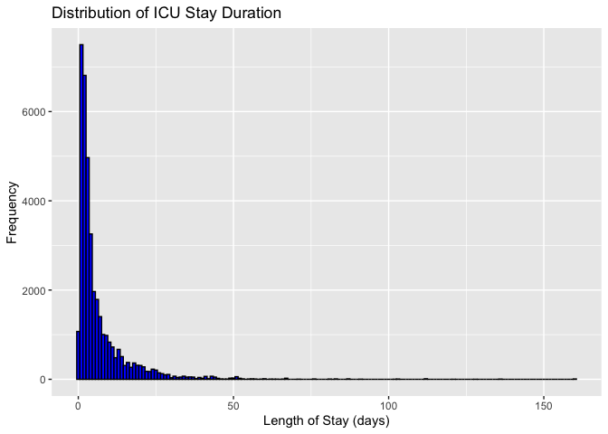
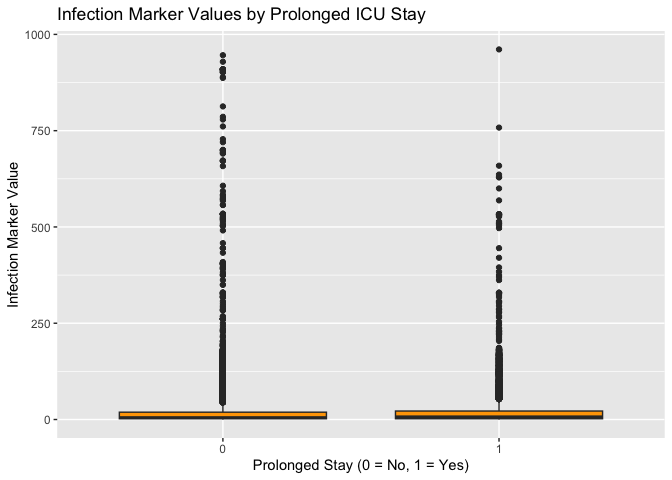
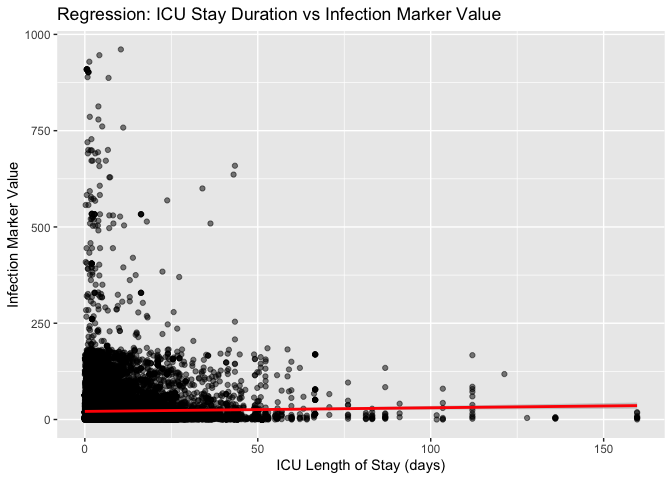
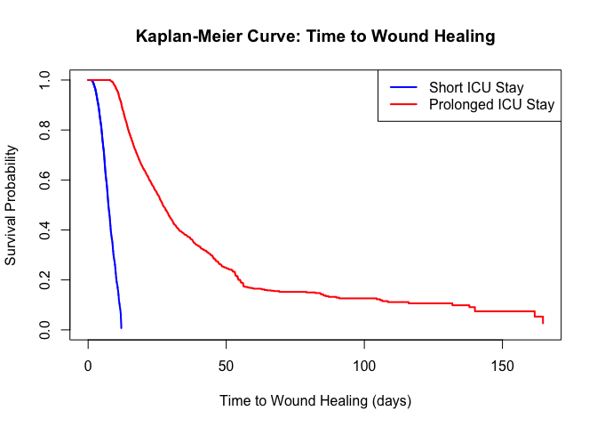
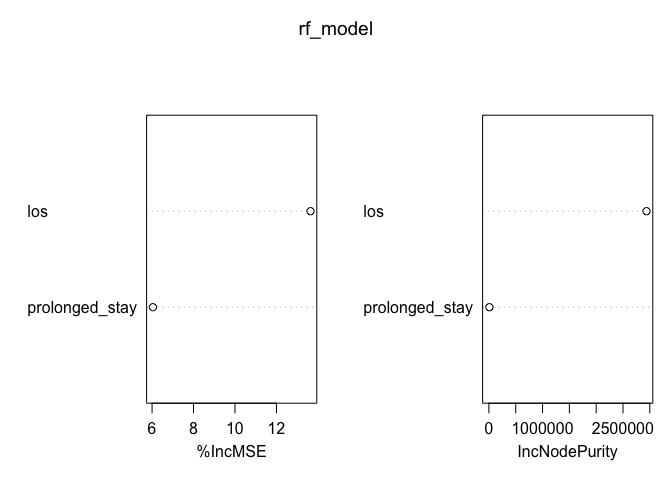

Amy Mimic Thesis
================
Amy.Wu
2024-11-27

# ———————————————————–

# Setup: Install and Load Required Libraries

# ———————————————————–

``` r
options(repos = c(CRAN = "https://cloud.r-project.org"))

# Vector of packages needed for this project
required_pkgs <- c("dplyr", "readr", "ggplot2", "survival", 
                   "randomForest", "stringr")

# Install any packages that aren't already installed, then load them
for (pkg in required_pkgs) {
  if (!require(pkg, character.only = TRUE)) {
    install.packages(pkg, dependencies = TRUE)
    library(pkg, character.only = TRUE)
  }
}
```

    ## Loading required package: dplyr

    ## 
    ## Attaching package: 'dplyr'

    ## The following objects are masked from 'package:stats':
    ## 
    ##     filter, lag

    ## The following objects are masked from 'package:base':
    ## 
    ##     intersect, setdiff, setequal, union

    ## Loading required package: readr

    ## Loading required package: ggplot2

    ## Loading required package: survival

    ## Loading required package: randomForest

    ## randomForest 4.7-1.2

    ## Type rfNews() to see new features/changes/bug fixes.

    ## 
    ## Attaching package: 'randomForest'

    ## The following object is masked from 'package:ggplot2':
    ## 
    ##     margin

    ## The following object is masked from 'package:dplyr':
    ## 
    ##     combine

    ## Loading required package: stringr

# ———————————————————–

# Aim One: Investigate the relationship between ICU stay duration

# and wound healing outcomes in diabetic patients,

# identifying key predictors of impaired healing.

# ———————————————————–

# ———————————————————–

# Section 1: Load Data from Local CSV Files

# ———————————————————–

``` r
# Define file paths (update these paths as necessary)
data_dir <- "/Users/wuxiaoyu/Desktop/9419 Master's Essay/mimic-iv-3.1"
patients_file           <- file.path(data_dir, "hosp", "patients.csv")
icustays_file           <- file.path(data_dir, "icu", "icustays.csv")
diagnoses_icd_file      <- file.path(data_dir, "hosp", "diagnoses_icd.csv")
labevents_file          <- file.path(data_dir, "hosp", "labevents.csv")
procedureevents_file    <- file.path(data_dir, "icu", "procedureevents.csv")
microbiologyevents_file <- file.path(data_dir, "hosp", "microbiologyevents.csv")
d_labitems_file         <- file.path(data_dir, "hosp", "d_labitems.csv")
d_icd_procedures_file   <- file.path(data_dir, "hosp", "d_icd_procedures.csv")

# Read CSV files using readr::read_csv for faster performance
patients            <- read_csv(patients_file)
```

    ## Rows: 364627 Columns: 6
    ## ── Column specification ────────────────────────────────────────────────────────
    ## Delimiter: ","
    ## chr  (2): gender, anchor_year_group
    ## dbl  (3): subject_id, anchor_age, anchor_year
    ## date (1): dod
    ## 
    ## ℹ Use `spec()` to retrieve the full column specification for this data.
    ## ℹ Specify the column types or set `show_col_types = FALSE` to quiet this message.

``` r
icustays            <- read_csv(icustays_file)
```

    ## Rows: 94458 Columns: 8
    ## ── Column specification ────────────────────────────────────────────────────────
    ## Delimiter: ","
    ## chr  (2): first_careunit, last_careunit
    ## dbl  (4): subject_id, hadm_id, stay_id, los
    ## dttm (2): intime, outtime
    ## 
    ## ℹ Use `spec()` to retrieve the full column specification for this data.
    ## ℹ Specify the column types or set `show_col_types = FALSE` to quiet this message.

``` r
diagnoses_icd       <- read_csv(diagnoses_icd_file)
```

    ## Rows: 6364488 Columns: 5
    ## ── Column specification ────────────────────────────────────────────────────────
    ## Delimiter: ","
    ## chr (1): icd_code
    ## dbl (4): subject_id, hadm_id, seq_num, icd_version
    ## 
    ## ℹ Use `spec()` to retrieve the full column specification for this data.
    ## ℹ Specify the column types or set `show_col_types = FALSE` to quiet this message.

``` r
labevents           <- read_csv(labevents_file)
```

    ## Rows: 158374764 Columns: 16
    ## ── Column specification ────────────────────────────────────────────────────────
    ## Delimiter: ","
    ## chr  (6): order_provider_id, value, valueuom, flag, priority, comments
    ## dbl  (8): labevent_id, subject_id, hadm_id, specimen_id, itemid, valuenum, r...
    ## dttm (2): charttime, storetime
    ## 
    ## ℹ Use `spec()` to retrieve the full column specification for this data.
    ## ℹ Specify the column types or set `show_col_types = FALSE` to quiet this message.

``` r
procedureevents     <- read_csv(procedureevents_file)
```

    ## Rows: 808706 Columns: 22
    ## ── Column specification ────────────────────────────────────────────────────────
    ## Delimiter: ","
    ## chr   (6): valueuom, location, locationcategory, ordercategoryname, ordercat...
    ## dbl  (13): subject_id, hadm_id, stay_id, caregiver_id, itemid, value, orderi...
    ## dttm  (3): starttime, endtime, storetime
    ## 
    ## ℹ Use `spec()` to retrieve the full column specification for this data.
    ## ℹ Specify the column types or set `show_col_types = FALSE` to quiet this message.

``` r
microbiologyevents  <- read_csv(microbiologyevents_file)
```

    ## Warning: One or more parsing issues, call `problems()` on your data frame for details,
    ## e.g.:
    ##   dat <- vroom(...)
    ##   problems(dat)

    ## Rows: 3988224 Columns: 25
    ## ── Column specification ────────────────────────────────────────────────────────
    ## Delimiter: ","
    ## chr   (9): order_provider_id, spec_type_desc, test_name, org_name, ab_name, ...
    ## dbl  (11): microevent_id, subject_id, hadm_id, micro_specimen_id, spec_itemi...
    ## lgl   (1): quantity
    ## dttm  (4): chartdate, charttime, storedate, storetime
    ## 
    ## ℹ Use `spec()` to retrieve the full column specification for this data.
    ## ℹ Specify the column types or set `show_col_types = FALSE` to quiet this message.

``` r
d_labitems          <- read_csv(d_labitems_file)
```

    ## Rows: 1650 Columns: 4
    ## ── Column specification ────────────────────────────────────────────────────────
    ## Delimiter: ","
    ## chr (3): label, fluid, category
    ## dbl (1): itemid
    ## 
    ## ℹ Use `spec()` to retrieve the full column specification for this data.
    ## ℹ Specify the column types or set `show_col_types = FALSE` to quiet this message.

``` r
d_icd_procedures    <- read_csv(d_icd_procedures_file)
```

    ## Rows: 86423 Columns: 3
    ## ── Column specification ────────────────────────────────────────────────────────
    ## Delimiter: ","
    ## chr (2): icd_code, long_title
    ## dbl (1): icd_version
    ## 
    ## ℹ Use `spec()` to retrieve the full column specification for this data.
    ## ℹ Specify the column types or set `show_col_types = FALSE` to quiet this message.

# ———————————————————–

# Section 2: Define the Diabetic Cohort

# ———————————————————–

``` r
# Filter for diabetes-related ICD codes
diabetic_patients <- diagnoses_icd %>%
  filter(str_starts(icd_code, "250") |  # ICD-9: 250.xx
         str_starts(icd_code, "E08") |  # ICD-10: E08
         str_starts(icd_code, "E09") |
         str_starts(icd_code, "E10") |
         str_starts(icd_code, "E11") |
         str_starts(icd_code, "E13")) %>%
  select(subject_id) %>%
  distinct()

# Preview diabetic patients
head(diabetic_patients)
```

    ## # A tibble: 6 × 1
    ##   subject_id
    ##        <dbl>
    ## 1   10000635
    ## 2   10000980
    ## 3   10001176
    ## 4   10001843
    ## 5   10001877
    ## 6   10002013

``` r
# Extract ICU stays for diabetic patients and keep key columns
diabetic_icu_stays <- icustays %>%
  inner_join(diabetic_patients, by = "subject_id") %>%
  select(subject_id, stay_id, los)
head(diabetic_icu_stays)
```

    ## # A tibble: 6 × 3
    ##   subject_id  stay_id   los
    ##        <dbl>    <dbl> <dbl>
    ## 1   10000980 39765666 0.498
    ## 2   10001843 39698942 0.825
    ## 3   10002013 39060235 1.31 
    ## 4   10002443 35044219 2.75 
    ## 5   10002495 36753294 5.09 
    ## 6   10005593 32896438 0.293

# ———————————————————–

# Section 3: Define Wound Healing Outcomes

# ———————————————————–

``` r
# (A) Identify Infection-Related Lab Tests
# Get unique lab test descriptions from d_labitems
lab_test_list <- d_labitems %>%
  select(itemid, label) %>%
  distinct()

# Save and inspect the lab test list if needed
write_csv(lab_test_list, "lab_test_list.csv")

# Filter for infection-related terms (e.g., "infection", "WBC", "CRP", "sepsis", "culture")
infection_markers <- lab_test_list %>%
  filter(str_detect(label, regex("infection|WBC|CRP|sepsis|culture", ignore_case = TRUE)))
write_csv(infection_markers, "infection_markers.csv")

# Vector of infection marker item IDs
infection_lab_items <- infection_markers$itemid

# (B) Filter labevents for infection markers and join with ICU stay info
labevents_with_stay_id <- labevents %>%
  inner_join(icustays, by = c("subject_id", "hadm_id")) %>%
  select(subject_id, stay_id, hadm_id, itemid, value, valuenum, flag)
```

    ## Warning in inner_join(., icustays, by = c("subject_id", "hadm_id")): Detected an unexpected many-to-many relationship between `x` and `y`.
    ## ℹ Row 33009 of `x` matches multiple rows in `y`.
    ## ℹ Row 1 of `y` matches multiple rows in `x`.
    ## ℹ If a many-to-many relationship is expected, set `relationship =
    ##   "many-to-many"` to silence this warning.

``` r
# Filter for infection markers
wound_healing_labs <- labevents_with_stay_id %>%
  filter(itemid %in% infection_lab_items) %>%
  select(subject_id, stay_id, itemid, value, valuenum, flag)
head(wound_healing_labs)
```

    ## # A tibble: 6 × 6
    ##   subject_id  stay_id itemid value valuenum flag    
    ##        <dbl>    <dbl>  <dbl> <chr>    <dbl> <chr>   
    ## 1   10000690 37081114  51516 3-5         NA <NA>    
    ## 2   10001217 34592300  51516 <NA>        NA <NA>    
    ## 3   10001725 31205490  51516 4            4 <NA>    
    ## 4   10001884 37510196  51516 3            3 <NA>    
    ## 5   10001884 37510196  51516 21          21 abnormal
    ## 6   10002155 32358465  51516 <NA>        NA <NA>

``` r
# (C) Identify Wound-Related Procedures
# Extract unique procedure descriptions from d_icd_procedures
procedure_list <- d_icd_procedures %>%
  select(icd_code, long_title) %>%  # Adjust column names if needed
  distinct()
write_csv(procedure_list, "procedure_list.csv")

# Filter for wound-related keywords in procedure descriptions
wound_icd_procedures <- procedure_list %>%
  filter(str_detect(long_title, regex("wound|ulcer|debridement|dressing|skin|abscess", ignore_case = TRUE)))
write_csv(wound_icd_procedures, "wound_icd_procedures.csv")

# Get wound-related ICD codes and filter procedureevents
wound_icd_codes <- wound_icd_procedures$icd_code
wound_procedures <- procedureevents %>%
  filter(itemid %in% wound_icd_codes) %>%  # Assuming itemid contains the procedure codes
  select(subject_id, stay_id, hadm_id, itemid, starttime, value)
write_csv(wound_procedures, "wound_procedures.csv")
head(wound_procedures)
```

    ## # A tibble: 0 × 6
    ## # ℹ 6 variables: subject_id <dbl>, stay_id <dbl>, hadm_id <dbl>, itemid <dbl>,
    ## #   starttime <dttm>, value <dbl>

``` r
# (D) Extract Wound-Related Microbiology Events
# List and inspect unique specimen types
unique_specimen_types <- microbiologyevents %>%
  select(spec_type_desc) %>%
  distinct()
write_csv(unique_specimen_types, "unique_specimen_types.csv")

# Filter for wound-related specimen types
wound_specimens <- microbiologyevents %>%
  filter(str_detect(spec_type_desc, regex("wound|tissue|abscess|drainage", ignore_case = TRUE)))
write_csv(wound_specimens, "wound_specimens.csv")
head(wound_specimens)
```

    ## # A tibble: 6 × 25
    ##   microevent_id subject_id  hadm_id micro_specimen_id order_provider_id
    ##           <dbl>      <dbl>    <dbl>             <dbl> <chr>            
    ## 1           408   10001186 24906418           6077400 <NA>             
    ## 2           410   10001186 24906418           6077400 <NA>             
    ## 3           411   10001186 24906418           6077400 <NA>             
    ## 4           414   10001186 24016413           2409946 <NA>             
    ## 5           415   10001186 24016413           2409946 <NA>             
    ## 6           416   10001186 24016413           2409946 <NA>             
    ## # ℹ 20 more variables: chartdate <dttm>, charttime <dttm>, spec_itemid <dbl>,
    ## #   spec_type_desc <chr>, test_seq <dbl>, storedate <dttm>, storetime <dttm>,
    ## #   test_itemid <dbl>, test_name <chr>, org_itemid <dbl>, org_name <chr>,
    ## #   isolate_num <dbl>, quantity <lgl>, ab_itemid <dbl>, ab_name <chr>,
    ## #   dilution_text <chr>, dilution_comparison <chr>, dilution_value <dbl>,
    ## #   interpretation <chr>, comments <chr>

``` r
# Further filter for wound-related test names (e.g., "culture", "bacteria", etc.)
wound_tests <- wound_specimens %>%
  filter(str_detect(test_name, regex("culture|bacteria|susceptibility|stain", ignore_case = TRUE))) %>%
  select(subject_id, hadm_id, spec_type_desc, test_name, org_name, ab_name, comments)
write_csv(wound_tests, "wound_tests.csv")
head(wound_tests)
```

    ## # A tibble: 6 × 7
    ##   subject_id  hadm_id spec_type_desc test_name         org_name ab_name comments
    ##        <dbl>    <dbl> <chr>          <chr>             <chr>    <chr>   <chr>   
    ## 1   10001186 24906418 TISSUE         GRAM STAIN        <NA>     <NA>    1+    (…
    ## 2   10001186 24906418 TISSUE         ANAEROBIC CULTURE <NA>     <NA>    NO ANAE…
    ## 3   10001186 24016413 TISSUE         GRAM STAIN        <NA>     <NA>    1+    (…
    ## 4   10001186 24016413 TISSUE         ANAEROBIC CULTURE <NA>     <NA>    NO GROW…
    ## 5   10001186 21334040 TISSUE         FUNGAL CULTURE    CANDIDA… <NA>    <NA>    
    ## 6   10001186 21334040 TISSUE         GRAM STAIN        <NA>     <NA>    NO POLY…

``` r
# Extract and save wound test results (comments and results)
wound_results <- wound_tests %>%
  select(subject_id, hadm_id, test_name, org_name, ab_name, comments)
write_csv(wound_results, "wound_results.csv")
head(wound_results)
```

    ## # A tibble: 6 × 6
    ##   subject_id  hadm_id test_name         org_name             ab_name comments   
    ##        <dbl>    <dbl> <chr>             <chr>                <chr>   <chr>      
    ## 1   10001186 24906418 GRAM STAIN        <NA>                 <NA>    1+    (<1 …
    ## 2   10001186 24906418 ANAEROBIC CULTURE <NA>                 <NA>    NO ANAEROB…
    ## 3   10001186 24016413 GRAM STAIN        <NA>                 <NA>    1+    (<1 …
    ## 4   10001186 24016413 ANAEROBIC CULTURE <NA>                 <NA>    NO GROWTH. 
    ## 5   10001186 21334040 FUNGAL CULTURE    CANDIDA PARAPSILOSIS <NA>    <NA>       
    ## 6   10001186 21334040 GRAM STAIN        <NA>                 <NA>    NO POLYMOR…

# ———————————————————–

# Section 4: Combine Data into a Unified Dataset

# ———————————————————–

``` r
# Merge diabetic ICU stay data with wound-related labs, procedures, and microbiology results
icu_wound_data <- diabetic_icu_stays %>%
  left_join(wound_healing_labs, by = c("subject_id", "stay_id")) %>%
  left_join(wound_procedures, by = c("subject_id", "stay_id")) %>%
  left_join(wound_results, by = c("subject_id", "hadm_id")) %>%
  mutate(prolonged_stay = if_else(los > 7, 1, 0))  # Flag for prolonged ICU stay (>7 days)
```

    ## Warning in left_join(., wound_results, by = c("subject_id", "hadm_id")): Detected an unexpected many-to-many relationship between `x` and `y`.
    ## ℹ Row 3 of `x` matches multiple rows in `y`.
    ## ℹ Row 309 of `y` matches multiple rows in `x`.
    ## ℹ If a many-to-many relationship is expected, set `relationship =
    ##   "many-to-many"` to silence this warning.

``` r
# Check and fix any empty column names by replacing them with a placeholder ("unknown")
icu_wound_data <- icu_wound_data %>%
  rename_with(~ ifelse(. == "", "unknown", .))

# Save the combined dataset (optional)
write_csv(icu_wound_data, "icu_wound_data.csv")
```

# ———————————————————–

# Section 5: Data Preprocessing and Cleaning

# ———————————————————–

``` r
# (A) Remove Duplicates
icu_wound_data <- icu_wound_data %>%
  distinct()

# (B) Consolidate and Clean Value Columns
# Since there is no column named "value" (only value.x and value.y exist),
# we convert those to numeric and then coalesce them into a new "value" column.
icu_wound_data <- icu_wound_data %>%
  mutate(across(c(value.x, value.y), ~ as.numeric(if_else(. %in% c("N/A", ""), NA_character_, as.character(.))))) %>%
  mutate(value = coalesce(value.x, value.y))
```

    ## Warning: There was 1 warning in `mutate()`.
    ## ℹ In argument: `across(...)`.
    ## Caused by warning:
    ## ! NAs introduced by coercion

``` r
# (C) Handle Missing Values in Critical Columns
icu_wound_data <- icu_wound_data %>%
  filter(!is.na(value), !is.na(los))
  
# Optionally, impute any remaining missing 'value' (here we use the mean)
icu_wound_data <- icu_wound_data %>%
  mutate(value = if_else(is.na(value), mean(value, na.rm = TRUE), value))

# (D) Select Only the Necessary Columns
icu_wound_data <- icu_wound_data %>%
  select(subject_id, stay_id, los, value, test_name, org_name, prolonged_stay)

# Verify data structure and summary
str(icu_wound_data)
```

    ## tibble [38,509 × 7] (S3: tbl_df/tbl/data.frame)
    ##  $ subject_id    : num [1:38509] 1e+07 1e+07 1e+07 1e+07 1e+07 ...
    ##  $ stay_id       : num [1:38509] 32896438 34389119 32604416 32604416 31316840 ...
    ##  $ los           : num [1:38509] 0.293 3.104 2.359 2.359 15.973 ...
    ##  $ value         : num [1:38509] 1 1 28 3 9 0 7 7 7 2 ...
    ##  $ test_name     : chr [1:38509] NA NA NA NA ...
    ##  $ org_name      : chr [1:38509] NA NA NA NA ...
    ##  $ prolonged_stay: num [1:38509] 0 0 0 0 1 0 0 0 0 1 ...

``` r
summary(icu_wound_data)
```

    ##    subject_id          stay_id              los                value       
    ##  Min.   :10005593   Min.   :30000213   Min.   :  0.00145   Min.   :  0.00  
    ##  1st Qu.:12568324   1st Qu.:32448257   1st Qu.:  1.66575   1st Qu.:  2.00  
    ##  Median :14887879   Median :34993800   Median :  3.21083   Median :  6.00  
    ##  Mean   :14958269   Mean   :34944431   Mean   :  6.58580   Mean   : 21.67  
    ##  3rd Qu.:17305519   3rd Qu.:37383964   3rd Qu.:  7.70287   3rd Qu.: 20.00  
    ##  Max.   :19999287   Max.   :39999230   Max.   :159.66681   Max.   :961.00  
    ##   test_name           org_name         prolonged_stay  
    ##  Length:38509       Length:38509       Min.   :0.0000  
    ##  Class :character   Class :character   1st Qu.:0.0000  
    ##  Mode  :character   Mode  :character   Median :0.0000  
    ##                                        Mean   :0.2696  
    ##                                        3rd Qu.:1.0000  
    ##                                        Max.   :1.0000

``` r
head(icu_wound_data)
```

    ## # A tibble: 6 × 7
    ##   subject_id  stay_id    los value test_name org_name prolonged_stay
    ##        <dbl>    <dbl>  <dbl> <dbl> <chr>     <chr>             <dbl>
    ## 1   10005593 32896438  0.293     1 <NA>      <NA>                  0
    ## 2   10005593 34389119  3.10      1 <NA>      <NA>                  0
    ## 3   10005817 32604416  2.36     28 <NA>      <NA>                  0
    ## 4   10005817 32604416  2.36      3 <NA>      <NA>                  0
    ## 5   10005817 31316840 16.0       9 <NA>      <NA>                  1
    ## 6   10007785 36549976  0.740     0 <NA>      <NA>                  0

# ———————————————————–

# Section 6: Descriptive Statistics and Visualization

# ———————————————————–

``` r
# Summary statistics for ICU length of stay and infection marker values
summary(icu_wound_data$los)
```

    ##      Min.   1st Qu.    Median      Mean   3rd Qu.      Max. 
    ##   0.00145   1.66575   3.21083   6.58580   7.70287 159.66681

``` r
summary(icu_wound_data$value)
```

    ##    Min. 1st Qu.  Median    Mean 3rd Qu.    Max. 
    ##    0.00    2.00    6.00   21.67   20.00  961.00

``` r
# Grouped summary by prolonged stay
prolonged_summary <- icu_wound_data %>%
  group_by(prolonged_stay) %>%
  summarise(
    count = n(),
    mean_los = mean(los, na.rm = TRUE),
    mean_value = mean(value, na.rm = TRUE),
    .groups = "drop"
  )
print(prolonged_summary)
```

    ## # A tibble: 2 × 4
    ##   prolonged_stay count mean_los mean_value
    ##            <dbl> <int>    <dbl>      <dbl>
    ## 1              0 28126     2.67       21.4
    ## 2              1 10383    17.2        22.4

``` r
# Plot histogram of ICU length of stay
ggplot(icu_wound_data, aes(x = los)) +
  geom_histogram(binwidth = 1, fill = "blue", color = "black") +
  labs(title = "Distribution of ICU Stay Duration",
       x = "Length of Stay (days)",
       y = "Frequency")
```

<!-- -->

``` r
# Boxplot of infection marker values by prolonged stay status
ggplot(icu_wound_data, aes(x = factor(prolonged_stay), y = value)) +
  geom_boxplot(fill = "orange") +
  labs(title = "Infection Marker Values by Prolonged ICU Stay",
       x = "Prolonged Stay (0 = No, 1 = Yes)",
       y = "Infection Marker Value")
```

<!-- -->

# ———————————————————–

# Section 7: Regression Analysis

# ———————————————————–

``` r
# Linear regression: Predict infection marker value using ICU LOS and prolonged stay flag
reg_model <- lm(value ~ los + prolonged_stay, data = icu_wound_data)
summary(reg_model)
```

    ## 
    ## Call:
    ## lm(formula = value ~ los + prolonged_stay, data = icu_wound_data)
    ## 
    ## Residuals:
    ##    Min     1Q Median     3Q    Max 
    ## -39.08 -19.50 -15.77  -1.65 939.39 
    ## 
    ## Coefficients:
    ##                Estimate Std. Error t value Pr(>|t|)    
    ## (Intercept)     21.0914     0.3034  69.519  < 2e-16 ***
    ## los              0.1171     0.0367   3.190  0.00142 ** 
    ## prolonged_stay  -0.6996     0.7680  -0.911  0.36233    
    ## ---
    ## Signif. codes:  0 '***' 0.001 '**' 0.01 '*' 0.05 '.' 0.1 ' ' 1
    ## 
    ## Residual standard error: 48.16 on 38506 degrees of freedom
    ## Multiple R-squared:  0.0003491,  Adjusted R-squared:  0.0002972 
    ## F-statistic: 6.724 on 2 and 38506 DF,  p-value: 0.001203

``` r
# Plot regression results: Scatter plot with fitted regression line
ggplot(icu_wound_data, aes(x = los, y = value)) +
  geom_point(alpha = 0.5) +
  geom_smooth(method = "lm", color = "red") +
  labs(title = "Regression: ICU Stay Duration vs Infection Marker Value",
       x = "ICU Length of Stay (days)",
       y = "Infection Marker Value")
```

    ## `geom_smooth()` using formula = 'y ~ x'

<!-- -->

# ———————————————————–

# Section 8: Kaplan-Meier Survival Analysis

# ———————————————————–

``` r
# Here we simulate wound healing times.
# Replace this simulation with actual healing data if available.
set.seed(123)  # For reproducibility
icu_wound_data <- icu_wound_data %>%
  mutate(
    healing_time = los + sample(1:5, n(), replace = TRUE),
    healed = if_else(value < 5, 1, 0)  # Define healing based on infection marker threshold
  )

# Fit Kaplan-Meier survival model
km_fit <- survfit(Surv(healing_time, healed) ~ prolonged_stay, data = icu_wound_data)

# Plot Kaplan-Meier survival curves
plot(km_fit, col = c("blue", "red"), lwd = 2,
     xlab = "Time to Wound Healing (days)",
     ylab = "Survival Probability",
     main = "Kaplan-Meier Curve: Time to Wound Healing")
legend("topright", legend = c("Short ICU Stay", "Prolonged ICU Stay"),
       col = c("blue", "red"), lwd = 2)
```

<!-- -->

# ———————————————————–

# Section 9: Random Forest Feature Importance

# ———————————————————–

``` r
# Prepare data for random forest analysis by selecting relevant variables and removing NAs
rf_data <- icu_wound_data %>%
  select(value, los, prolonged_stay) %>%
  na.omit()

# Train the random forest model (predicting infection marker value)
rf_model <- randomForest(
  value ~ los + prolonged_stay,
  data = rf_data,
  importance = TRUE,
  ntree = 500
)

# Print and plot feature importance
print(importance(rf_model))
```

    ##                  %IncMSE IncNodePurity
    ## los            13.642959   2938579.080
    ## prolonged_stay  6.041993      8735.198

``` r
varImpPlot(rf_model)
```

<!-- -->
\# ———————————————————– \# Section 10: Identifying Key Predictors of
Impaired Healing \# ———————————————————–

``` r
# Examine the range of infection marker values
icu_wound_data %>% 
  summarise(
    min_value = min(value, na.rm = TRUE),
    max_value = max(value, na.rm = TRUE)
  )
```

    ## # A tibble: 1 × 2
    ##   min_value max_value
    ##       <dbl>     <dbl>
    ## 1         0       961

``` r
# Expected output: min_value = 0, max_value = 961

# Create a binary outcome for impaired healing using a threshold of 100.
# Here, values >= 100 are considered indicative of impaired healing.
icu_wound_data <- icu_wound_data %>%
  mutate(impaired_healing = if_else(value >= 100, 1, 0))

# Check the distribution of the new outcome variable
print(table(icu_wound_data$impaired_healing))
```

    ## 
    ##     0     1 
    ## 36460  2049

``` r
# Fit a logistic regression model to assess predictors of impaired healing
logit_model <- glm(impaired_healing ~ los + prolonged_stay, 
                   data = icu_wound_data, 
                   family = binomial)

# Display the summary of the logistic regression model
summary(logit_model)
```

    ## 
    ## Call:
    ## glm(formula = impaired_healing ~ los + prolonged_stay, family = binomial, 
    ##     data = icu_wound_data)
    ## 
    ## Coefficients:
    ##                 Estimate Std. Error  z value Pr(>|z|)    
    ## (Intercept)    -2.916919   0.027774 -105.022  < 2e-16 ***
    ## los             0.008486   0.002779    3.053  0.00226 ** 
    ## prolonged_stay -0.073035   0.067172   -1.087  0.27692    
    ## ---
    ## Signif. codes:  0 '***' 0.001 '**' 0.01 '*' 0.05 '.' 0.1 ' ' 1
    ## 
    ## (Dispersion parameter for binomial family taken to be 1)
    ## 
    ##     Null deviance: 16009  on 38508  degrees of freedom
    ## Residual deviance: 15999  on 38506  degrees of freedom
    ## AIC: 16005
    ## 
    ## Number of Fisher Scoring iterations: 5

``` r
# Calculate odds ratios and 95% confidence intervals for the predictors
exp_coef <- exp(coef(logit_model))
conf_int <- exp(confint(logit_model))
odds_ratios <- data.frame(
  Estimate = exp_coef, 
  Lower_CI = conf_int[, 1], 
  Upper_CI = conf_int[, 2]
)
print(odds_ratios)
```

    ##                 Estimate   Lower_CI   Upper_CI
    ## (Intercept)    0.0541001 0.05121587 0.05710771
    ## los            1.0085224 1.00281640 1.01382681
    ## prolonged_stay 0.9295683 0.81477657 1.06033500

# ———————————————————–

# Section 11: Cox Proportional Hazards Model for Time to Healing

# ———————————————————–

``` r
# Ensure the survival package is loaded
library(survival)

# Fit the Cox proportional hazards model using healing time and the event indicator (healed)
cox_model <- coxph(Surv(healing_time, healed) ~ los + prolonged_stay, 
                   data = icu_wound_data)

# Summarize the Cox model to review hazard ratios (HR) and p-values
summary(cox_model)
```

    ## Call:
    ## coxph(formula = Surv(healing_time, healed) ~ los + prolonged_stay, 
    ##     data = icu_wound_data)
    ## 
    ##   n= 38509, number of events= 17082 
    ## 
    ##                     coef exp(coef)  se(coef)        z Pr(>|z|)    
    ## los            -0.789789  0.453941  0.006723 -117.476   <2e-16 ***
    ## prolonged_stay -0.006701  0.993322  0.049325   -0.136    0.892    
    ## ---
    ## Signif. codes:  0 '***' 0.001 '**' 0.01 '*' 0.05 '.' 0.1 ' ' 1
    ## 
    ##                exp(coef) exp(-coef) lower .95 upper .95
    ## los               0.4539      2.203    0.4480     0.460
    ## prolonged_stay    0.9933      1.007    0.9018     1.094
    ## 
    ## Concordance= 0.872  (se = 0.001 )
    ## Likelihood ratio test= 42635  on 2 df,   p=<2e-16
    ## Wald test            = 16219  on 2 df,   p=<2e-16
    ## Score (logrank) test = 15387  on 2 df,   p=<2e-16
